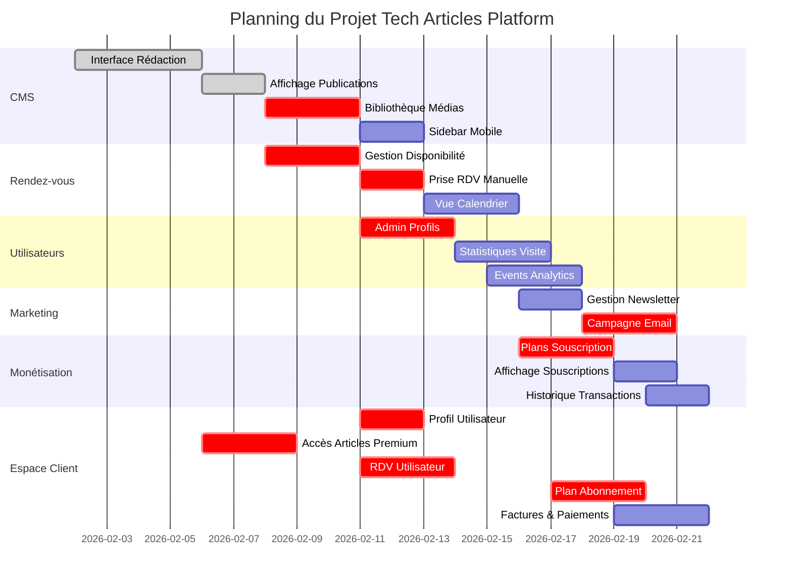

# Planning Gantt - Tech Articles Platform
## 2 février - 22 février 2026 (20 jours)

## 📊 Répartition par Semaine

### 🗓️ Semaine 1 : 2-8 février (Fondations)
**Focus :** CMS et Contenu Premium

| Jour | Lundi 2 | Mardi 3 | Mercredi 4 | Jeudi 5 | Vendredi 6 | Samedi 7 | Dimanche 8 |
|------|---------|---------|------------|---------|------------|----------|------------|
| **CMS** | 🔵 Interface Rédaction | 🔵 | 🔵 | 🔵 | ✅ Affichage Publi | ✅ | ✅ |
| **Client** | | | | | 🔵 Accès Premium | 🔵 | 🔵 |

**Issues actives :**
- ✅ #1 : Interface de Rédaction (échéance 6 fév)
- ✅ #2 : Affichage Publications (échéance 8 fév)
- 🔵 #20 : Accès Articles Payants (début)

---

### 🗓️ Semaine 2 : 9-15 février (Développement Principal)
**Focus :** Rendez-vous, Utilisateurs, Médias

| Jour | Lundi 9 | Mardi 10 | Mercredi 11 | Jeudi 12 | Vendredi 13 | Samedi 14 | Dimanche 15 |
|------|---------|----------|-------------|----------|-------------|-----------|-------------|
| **CMS** | ✅ Accès Premium | 🔵 Biblio Médias | 🔵 | 🔵 | 🔵 Sidebar | ✅ | |
| **RDV** | | 🔵 Gestion Dispo | 🔵 | 🔵 RDV Manuel | ✅ | 🔵 Calendrier | 🔵 |
| **Users** | | | 🔵 Admin Profils | 🔵 | 🔵 | ✅ | ✅ Vue Calendrier |
| **Client** | | | 🔵 Profil User | ✅ | 🔵 RDV User | 🔵 | ✅ |

**Issues actives :**
- ✅ #20 : Accès Articles Payants (fin 9 fév)
- 🔵 #3 : Bibliothèque Médias (échéance 10 fév)
- 🔵 #5 : Gestion Disponibilité (échéance 11 fév)
- ✅ #4 : Sidebar Mobile (échéance 12 fév)
- ✅ #6 : Prise RDV Manuelle (échéance 13 fév)
- ✅ #19 : Prise RDV Utilisateur (échéance 13 fév)
- ✅ #8 : Administration Comptes (échéance 14 fév)
- ✅ #16 : Profil Utilisateur (échéance 14 fév)
- ✅ #7 : Vue Calendrier (échéance 15 fév)

---

### 🗓️ Semaine 3 : 16-22 février (Finalisation)
**Focus :** Analytics, Marketing, Monétisation

| Jour | Lundi 16 | Mardi 17 | Mercredi 18 | Jeudi 19 | Vendredi 20 | Samedi 21 | Dimanche 22 |
|------|----------|----------|-------------|----------|-------------|-----------|-------------|
| **Analytics** | 🔵 Stats Visite | 🔵 | 🔵 Events | ✅ | | | |
| **Marketing** | | | 🔵 Gestion NL | ✅ | 🔵 Campagne Email | 🔵 | ✅ |
| **Billing** | 🔵 Plans Souscrip | 🔵 | 🔵 | ✅ | 🔵 Affich Souscr | ✅ | 🔵 Transact |
| **Client** | | 🔵 Plan User | 🔵 | ✅ | | 🔵 Factures | 🔵 |

**Issues actives :**
- ✅ #9 : Statistiques Visite (échéance 16 fév)
- ✅ #10 : Events Analytics (échéance 17 fév)
- ✅ #11 : Gestion Newsletter (échéance 18 fév)
- ✅ #13 : Plans Souscription (échéance 19 fév)
- ✅ #17 : Plan Souscription Utilisateur (échéance 19 fév)
- ✅ #12 : Campagne Email (échéance 20 fév)
- ✅ #14 : Souscriptions Actives (échéance 21 fév)
- ✅ #18 : Paiements Factures (échéance 21 fév)
- ✅ #15 : Historique Transactions (échéance 22 fév - FIN)

---

## 📈 Charge de Travail par Catégorie

### Dashboard Administrateur (12 issues)
- **CMS :** 4 issues (9 jours)
- **Rendez-vous :** 3 issues (7 jours)
- **Utilisateurs & Analytics :** 3 issues (7 jours)
- **Marketing & Newsletter :** 2 issues (5 jours)
- **Monétisation :** 3 issues (6 jours)

### Espace Utilisateur (5 issues)
- **Profil :** 1 issue (2 jours)
- **Abonnement :** 1 issue (3 jours)
- **Facturation :** 1 issue (2 jours)
- **Rendez-vous :** 1 issue (3 jours)
- **Contenu :** 1 issue (3 jours)

---

## 🎯 Jalons (Milestones)

### Jalon 1 : Fondations (8 février)
**Objectif :** CMS fonctionnel
- ✅ Interface de rédaction opérationnelle
- ✅ Affichage et gestion des articles
- 🎯 **Livrable :** Back-office CMS utilisable

### Jalon 2 : MVP Back-Office (15 février)
**Objectif :** Dashboard admin complet
- ✅ Système de rendez-vous
- ✅ Gestion des utilisateurs
- ✅ Bibliothèque de médias
- 🎯 **Livrable :** Dashboard administrateur fonctionnel

### Jalon 3 : MVP Front Client (19 février)
**Objectif :** Espace utilisateur opérationnel
- ✅ Profil utilisateur
- ✅ Prise de rendez-vous
- ✅ Accès contenu premium
- ✅ Gestion abonnement
- 🎯 **Livrable :** Espace utilisateur complet

### Jalon 4 : Lancement (22 février)
**Objectif :** Plateforme complète en production
- ✅ Analytics et tracking
- ✅ Marketing et newsletter
- ✅ Système de paiement complet
- 🎯 **Livrable :** Plateforme en production

---

## ⚡ Chemin Critique

Les issues sur le **chemin critique** (qui bloquent d'autres tâches) :

1. **Interface Rédaction** (#1) → Bloque tout le CMS
2. **Gestion Disponibilité** (#5) → Bloque les rendez-vous
3. **Plans Souscription** (#13) → Bloque la monétisation
4. **Admin Profils** (#8) → Bloque la gestion utilisateurs
5. **Accès Premium** (#20) → Bloque le modèle économique

⚠️ Ces issues doivent être traitées en priorité absolue !

---

## 👥 Répartition Suggérée (Équipe de 3)

### Développeur 1 : Back-end & API
**Focus :** CMS, Rendez-vous, Billing
- Semaine 1 : Issues #1, #2 (CMS)
- Semaine 2 : Issues #5, #6, #7 (Rendez-vous)
- Semaine 3 : Issues #13, #14, #15 (Monétisation)

### Développeur 2 : Back-end & Analytics
**Focus :** Utilisateurs, Analytics, Newsletter
- Semaine 1 : Issue #3 (Médias)
- Semaine 2 : Issues #8, #16 (Utilisateurs/Profils)
- Semaine 3 : Issues #9, #10, #11, #12 (Analytics & Marketing)

### Développeur 3 : Full-stack
**Focus :** Espace Client, Abonnements
- Semaine 1 : Issue #20 (Accès Premium)
- Semaine 2 : Issues #19, #4 (RDV Client & UI)
- Semaine 3 : Issues #17, #18 (Abonnements Client)

---

## 📊 Métriques de Suivi

### Vélocité Attendue
- **Semaine 1 :** 3 issues complétées (15%)
- **Semaine 2 :** 9 issues complétées (60% cumulé)
- **Semaine 3 :** 8 issues complétées (100% final)

### Indicateurs de Santé
- **Vert 🟢** : Dans les temps (≤ échéance)
- **Orange 🟠** : Retard léger (1 jour)
- **Rouge 🔴** : Retard important (≥ 2 jours)

### Points de Contrôle
- **Jour 7 (8 fév) :** 15% complété
- **Jour 14 (15 fév) :** 60% complété
- **Jour 21 (22 fév) :** 100% complété

---

## 🚀 Recommandations

### Pour respecter les délais :
1. **Daily Standup** à 9h chaque matin
2. **Code Review** max 2h après PR
3. **Tests automatisés** dès le début
4. **Documentation** au fil de l'eau
5. **Buffer** de 20% pour imprévus

### Gestion des risques :
- **Risque technique** : Prévoir des spike solutions
- **Risque de scope** : Prioriser MVP vs nice-to-have
- **Risque de dépendances** : Paralléliser au maximum
- **Risque de qualité** : Tests dès le début

---

**Légende :**
- 🔵 En cours
- ✅ Terminé
- ⏳ En attente
- 🔴 Bloqué
- ⚡ Critique

**Dernière mise à jour :** 2 février 2026
